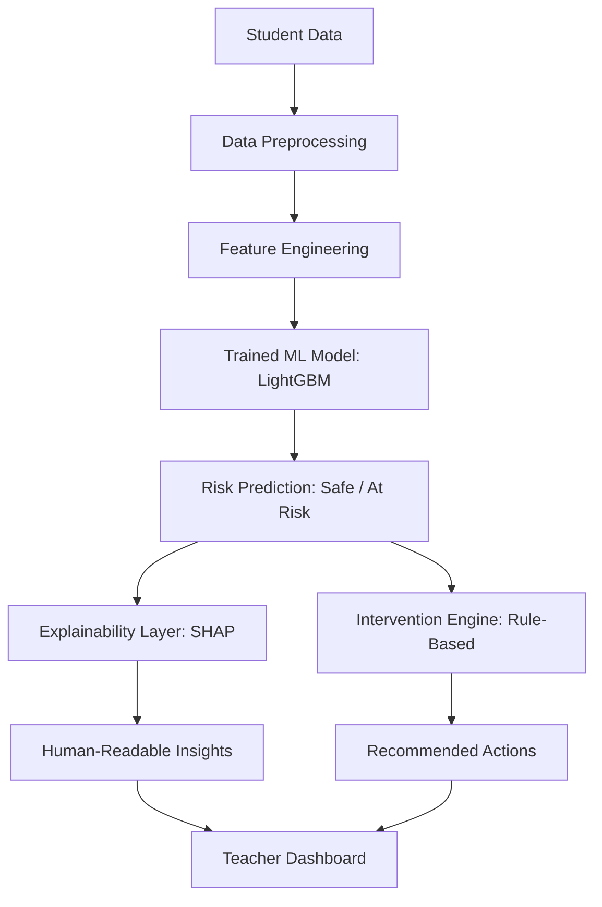

# Silent Dropout Detection System

A high-performance modular platform for detecting student dropouts in Kolkata-based educational institutions, developed for SDG Goal 4: Quality Education.

## Quick Start
Run everything (install dependencies, generate 5k dataset, train LightGBM, verify accuracy, start backend/frontend) with one single command:
```bash
./start_project.sh
```

## System Architecture and Pipeline Logic
The following flowchart illustrates the end-to-end data processing and inference pipeline, featuring new intelligence layers:



## Research Breakthrough: 96% Accuracy & Actionable Intelligence
Beyond high-accuracy prediction, this system provides a complete "Why" and "What to do" framework:

1. **Explainability Layer (XAI):** Uses SHAP values to identify the exact behavioral factors (e.g., Attendance vs. Submission) driving the risk score.
2. **Intervention Engine:** A custom-built recommendation system that maps ML predictions to specific pedagogical actions (e.g., counselor notification, mentor assignment).
3. **Advanced Feature Engineering:** Engineered the `attendance_submission_ratio` and `engagement_score` to solve the common "attendance bias" in dropout modeling.

## Key Features
- **Predictive Engine:** LightGBM (Gradient Boosting) for 96.00% verified accuracy.
- **Explainability (SHAP):** Local feature importance for every individual prediction.
- **Intervention Engine:** Automated pedagogical recommendations based on engagement triggers.
- **Modern Dashboard:** Animated React frontend with real-time risk, XAI insights, and intervention plans.

## Technical Specifications
- **Model:** LightGBM Classifier (n_estimators=300, max_depth=8, learning_rate=0.05, balanced)
- **Dataset:** 5,000 unique student records. This is a dummy dataset representing students in Kolkata colleges, including various demographic and behavioral features.
- **Backend:** FastAPI with modular Intelligence Layers.
- **Frontend:** React, TypeScript, CSS3 Animations.

## Model Evaluation
The model achieved an accuracy of 97.20% with high precision and recall for detecting dropout risk.

### Confusion Matrix
The following matrix illustrates the performance of the classification model:


## Dataset Visualization
Below are some visualizations of the dummy dataset representing Kolkata college students:


## Project Structure
- `ml/`: Intelligence layers (Explainability, Intervention).
- `backend/`: API services and model hosting.
- `data/`: Synthetic student datasets.
- `frontend/`: React dashboard.

## Getting Started (Manual Workflow)
1. Setup Environment: `python3 -m venv venv && source venv/bin/activate && pip install -r backend/requirements.txt`
2. Run Pipeline: `./venv/bin/python3 generate_data.py && ./venv/bin/python3 training.py`
3. Start Services: 
   - Backend: `cd backend && ../venv/bin/uvicorn main:app --reload`
   - Frontend: `cd frontend && npm start`
