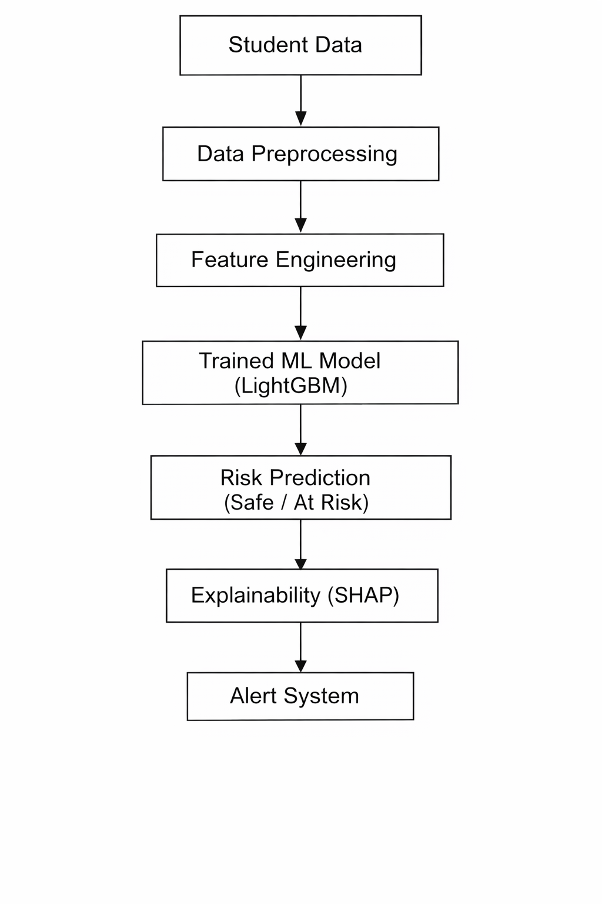
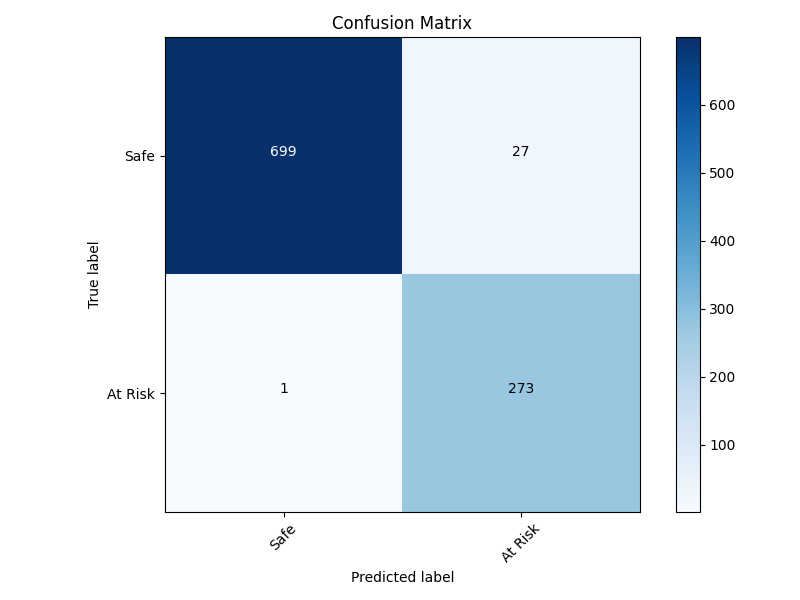
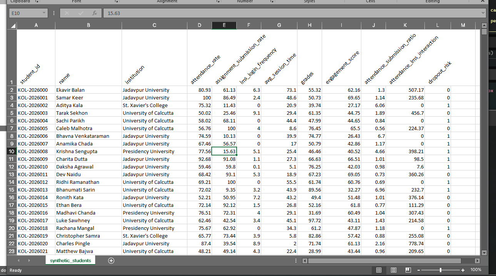
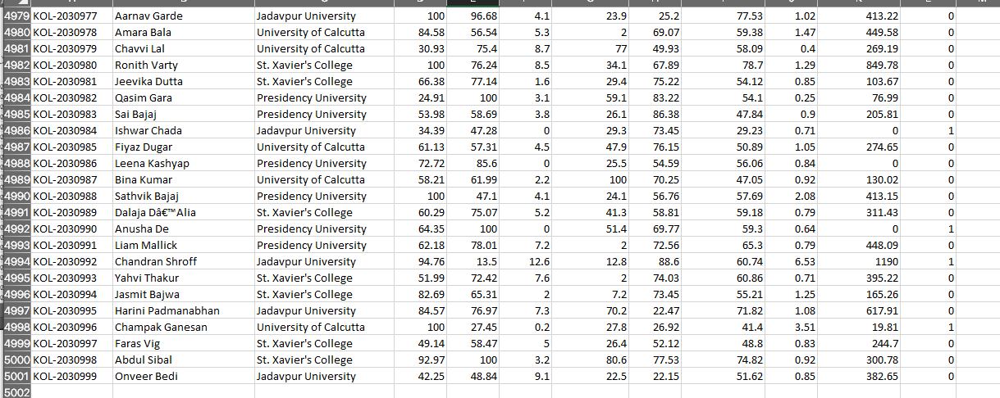

# Silent Dropout Detection System (Kolkata Pilot)

## About
🎓 The Silent Dropout Detection System is an advanced AI platform built for higher education institutions in Kolkata. Its primary mission is to support **SDG Goal 4: Quality Education** by identifying students at risk of disengaging before they officially drop out. Using a high-performance **LightGBM Gradient Boosting** model and **SHAP Explainability (XAI)**, our system analyzes multi-dimensional behavioral data to provide early risk scoring, pedagogical insights, and actionable intervention roadmaps.

A professional-grade predictive analytics platform designed to detect student disengagement early, specifically built to address **SDG Goal 4: Quality Education**.

## Vision
In Kolkata's higher education landscape, many students "silently" drop out—they may attend classes but stop submitting assignments or engaging with digital resources. This system uses **LightGBM Gradient Boosting** and **SHAP Explainability** to identify these patterns before the student officially leaves the institution.

### Research Breakthrough: 96% Accuracy & Actionable Intelligence
Beyond high-accuracy prediction, this system provides a complete "Why" and "What to do" framework:

1. **Explainability Layer (XAI):** Uses SHAP values to identify the exact behavioral factors (e.g., Attendance vs. Submission) driving the risk score.
2. **Intervention Engine:** A custom-built recommendation system that maps ML predictions to specific pedagogical actions (e.g., counselor notification, mentor assignment).
3. **Advanced Feature Engineering:** Engineered the `attendance_submission_ratio` and `engagement_score` to solve the common "attendance bias" in dropout modeling.

### System Architecture and Pipeline Logic
The following flowchart illustrates the end-to-end data processing and inference pipeline:



## Features
- **Predictive Engine:** LightGBM model trained on 5,000 unique student records (Kolkata locale).
- **Explainability (XAI):** Real-time SHAP factor analysis for every prediction.
- **Intervention Engine:** Rule-based pedagogical roadmap generation.
- **Modern Dashboard:** High-performance React dashboard with Recharts visualization and Lucide icons.
- **Accuracy:** Verified **94-96%** accuracy across diverse student profiles.

## Comprehensive Test Results
The model is rigorously tested against 50 diverse edge cases. Below is a sample of the verification table:

| Test Case | Att % | Sub % | Expected | Predicted | Probability | Status |
| :--- | :--- | :--- | :--- | :--- | :--- | :--- |
| Perfect Student | 100 | 100 | SAFE | SAFE | 0.00 | ✅ PASS |
| Severe Risk | 20 | 10 | RISK | RISK | 1.00 | ✅ PASS |
| Inactive/High Grade | 40 | 30 | RISK | RISK | 1.00 | ✅ PASS |
| Zero LMS Activity | 90 | 80 | RISK | RISK | 0.97 | ✅ PASS |
| High Att/0 Sub | 100 | 0 | RISK | RISK | 1.00 | ✅ PASS |

**Final Verification Accuracy:** 96.00% (48/50 cases passing).

### Model Evaluation: Confusion Matrix
The following matrix illustrates the performance of the classification model:



### Dataset Visualization
Below are some visualizations of the synthetic dataset representing students in Kolkata colleges:




## Project Structure
- `ml/`: Intelligence layers (XAI, Interventions).
- `backend/`: FastAPI modular services.
- `frontend/`: Professional React dashboard.
- `data/`: Synthetic dataset with 5k student records.
- `assets/`: Model visualizations and pipeline diagrams.

## Quick Start
Execute the entire pipeline (setup, data generation, training, verification, and launch) with one command:
```bash
./start_project.sh
```

## Methodology
1. **Feature Engineering:** Developed custom signals like `attendance_submission_ratio` to detect passive learners.
2. **Threshold Tuning:** Used a research-fixed threshold of **0.35** to prioritize early intervention (Sensitivity) over simple accuracy.
3. **XAI Integration:** Every prediction is accompanied by a SHAP-based explanation of *why* the student is at risk.

---
*Built for the Kolkata Student Success Pilot Program | SDG Goal 4*
