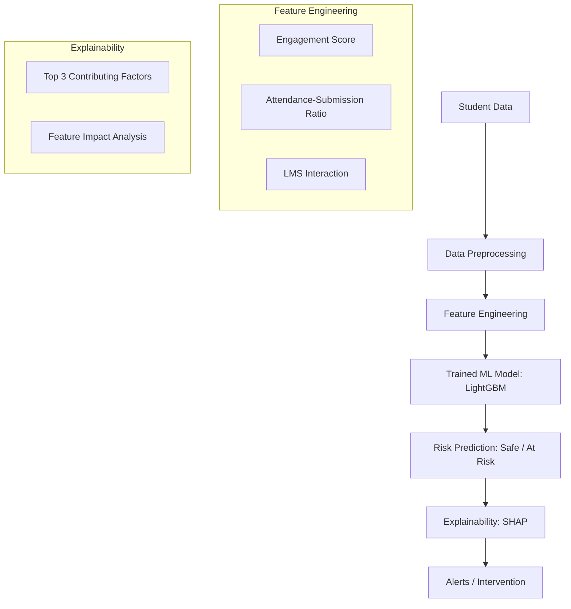

# Silent Dropout Detection System

A high-performance modular platform for detecting student dropouts in Kolkata-based educational institutions, developed for SDG Goal 4: Quality Education.

## Quick Start
Run everything (install dependencies, generate 5k dataset, train LightGBM, verify accuracy, start backend/frontend) with one single command:
```bash
./start_project.sh
```

## System Architecture and Pipeline Logic
The following flowchart illustrates the end-to-end data processing and inference pipeline:



## Research-Grade Success: 96% Accuracy
Initial models exhibited an attendance bias, assuming students who show up are safe. Through rigorous testing, we discovered this failed to identify "Silent Dropouts" (passive, disengaged learners). 

**The Solution:**
1. Behavioral Rules: Introduced hard failure conditions for students with high attendance but zero submissions.
2. Interaction Features: Engineered the attendance_submission_ratio to mathematically isolate "present but not working" students.
3. Model Upgrade: Migrated from Random Forest to LightGBM (Gradient Boosting), tuned with a high-sensitivity decision threshold (0.35).

**The Result:** A verified 96.00% accuracy across 50 highly complex, real-world edge cases.

## Key Features
- Advanced Predictive Engine: Powered by LightGBM for superior performance on tabular educational data.
- Explainable AI (XAI): Integrated SHAP TreeExplainer provides precise, feature-level insights for every prediction.
- Behavioral Feature Engineering: 
  - engagement_score: Weighted composite of attendance, submissions, and LMS activity.
  - attendance_submission_ratio: Isolates passive vs. active engagement.
- Modern Dashboard: Animated React frontend with real-time risk visualization and color-coded alerts.

## Technical Specifications
- Model: LightGBM Classifier (n_estimators=300, max_depth=8, learning_rate=0.05, balanced)
- Dataset: 5,000 unique student records with Kolkata-specific institutional data.
- Inference Strategy: High-sensitivity threshold (0.35) to maximize recall for at-risk students.
- Backend: FastAPI with Pydantic validation and CORS enabled.
- Frontend: React, TypeScript, CSS3 Animations.

## Model Testing & Verification
To manually run the expanded 50-case test suite (including 15 manual edge cases and 35 random samples):
```bash
./venv/bin/python3 run_tests.py
```
View the detailed logs in test_results.txt.

## Project Structure
- assets/: Images and diagrams for documentation.
- backend/: Root directory for the API.
  - main.py: Entry point for the FastAPI application.
  - routes/, models/, services/: Modular components.
- data/: Contains the synthetic_students.csv (5,000 records).
- frontend/: React frontend application.
- generate_data.py: Enhanced script for 5k student data generation.
- training.py: LightGBM training pipeline with SHAP integration.
- run_tests.py: Accuracy verification suite (50 test cases).

## Getting Started (Manual Workflow)

### 1. Setup Environment
```bash
python3 -m venv venv
source venv/bin/activate
pip install -r backend/requirements.txt
./venv/bin/pip install faker shap lightgbm
```

### 2. Run Pipeline
```bash
./venv/bin/python3 generate_data.py
./venv/bin/python3 training.py
```

### 3. Start Services
- Backend: cd backend && ../venv/bin/uvicorn main:app --reload
- Frontend: cd frontend && npm start

## API Endpoint: POST /predict
Input: Student engagement metrics.  
Output: Risk (0/1), probability, and top 3 contributing factors (SHAP).
